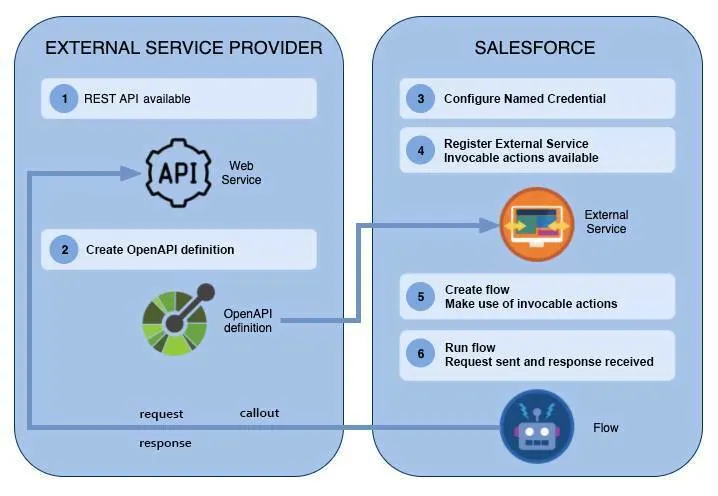

# Admin Intermediate

https://trailhead.salesforce.com/content/learn/trails/force_com_admin_intermediate

## Modules

* Formulas and Validations
* Data Security
* Picklist Administration
* Build a Suggestion Box App
* Approve Records with Approval Processes
* AppExchange Basics
* External Services
* Use External Services With a Flow
* Salesforce Mobile App Rollout
* Build a Space Station App

### Formulas and Validations

This module goes over formula fields in Salesforce and what we can do we them.

* Formula Fields
    + Cross Object Formulas are formula fields that will take a value from an associated object and display it on a different object. For example, contacts are associated with Accounts but maybe we want to display the account number on the contact. We can do this with a formula field.
    + You can also you formula fields for calculations and validations. Like calculating the days before close or setting a check box depending on some business rules.

* Roll-Up Summary Fields
    + These are fields that we can create when there is a master detail relationship present and they allow us to create roll up summaries on objects. For example we could create a roll up summary field on account to show total revenue from all opps that account is on.
    + There are Counts, Sum, Min, and Max roll up summary field types.

* Validation Rules
    + Validation rules verify that data entered by users in records meets the standards you specify before they can save it. A validation rule can contain a formula or expression that evaluates the data in one or more fields and returns a value of “True” or “False.”
    + You can create validation rules for objects, fields, campaign members, or case milestones.

### Data Security

This module goes over data security regarding the four levels of security in salesforce. 

* Levels of Data Access
    + the four levels at which you control data access—organization, objects, fields, and records
        + Org - For your whole org, you can maintain a list of authorized users, set password policies, and limit logins to certain hours and locations.
        + Object - Access to object-level data is the simplest thing to control. By setting permissions on a particular type of object, you can prevent a group of users from creating, viewing, editing, or deleting any records of that object
        + Fields - You can restrict access to certain fields, even if a user has access to the object
        + Records - You can allow particular users to view an object, but then restrict the individual object records they’re allowed to see

* Organization-wide defaults 
    + specify the default level of access users have to each other’s records. You use org-wide sharing settings to lock down your data to the most restrictive level, and then use the other record-level security and sharing tools to selectively give access to other users.

* Role hierarchies 
    + give users higher in the hierarchy access to all records owned by users below them in the hierarchy.

* Sharing rules 
    + are automatic exceptions to organization-wide defaults for particular groups of users, so they can get to records they don’t own or can’t normally see. Sharing rules, like role hierarchies, are only used to give additional users access to records.

* Manual sharing
    +  allows owners of particular records to share them with other users. Although manual sharing isn’t automated like org-wide sharing settings, role hierarchies, or sharing rules, it can be useful in some situations, such as when a recruiter going on vacation needs to temporarily assign ownership of a job application to someone else.

* Audits - AUDIT YOUR ORG!!
    + Record Modification Fields - All objects include fields to store the name of the user who created the record and who last modified the record. This provides some basic auditing information.
    + Login History - You can review a list of successful and failed login attempts for the past six months. For more information.
    + Field History Tracking - You can turn on auditing to automatically track changes in the values of individual fields. Although field-level auditing is available for all custom objects, only some standard objects allow it.
    + Setup Audit Trail - The Setup Audit Trail logs when modifications are made to your organization’s configuration.
    + Event Monitoring - lets you see the granular details of user activity (called events) in your organization. You can view information about individual events or track trends in events to swiftly identify abnormal behavior and safeguard your company’s data

* User Creation
    + User Creation - You can create users—even multiple users—in just a few clicks. It’s as simple as entering a username, alias, and email, and selecting a role, license, and profile. Many more options are available, of course, but that’s all you need to get started.
    + Salesforce auto-generates a password and notifies new users immediately. Users can change or add to their own personal information after they log in.

* Deactivating Users or Freeze Users
    + You can’t delete a user, but you can deactivate an account so a user can’t log in. Deactivated users lose access to all records. (That includes records that are shared with them individually and records shared with them as team members.) However, you can still transfer this data to other users and view the names on the Users page.
    + You can Freeze a user and they wont lose the access to records like when a user is deactivated but they wont be able to login.

* Password Policies
    + Set password and login policies, such as specifying an amount of time before all users’ passwords expire and the level of complexity required for passwords.
    + Expire the passwords for all the users in your org, except for users with “Password Never Expires” permission.
    + Reset the password for specified users
    + If a user is locked out due to too many failed login attempts, you can unlock the person’s access.

* Specify Trusted IP Ranges & Restrict Login via IP Range on Profiles
    + Anytime you log in from a different IP address, you’re asked to verify your identity, typically by entering a verification code. You can bypass this step for trusted IP ranges
    + By default, Salesforce doesn’t restrict locations for login access. If you do nothing, users can log in from any IP address. You can restrict where users can log in from using profiles. 

* Login Access by Time
    + For each profile, you can specify the hours when users can log in
    + If users are logged in when their login hours end, they can continue to view their current page, but they can’t take any further action.

* Object Permissions
    + Recomended that you start with Permission Sets and Permission set groups rather than profiles.
    + Profiles are Used to configure user’s default settings, such as assigned apps, record types, page layouts. Users are assigned one profile.
    + You can’t edit the object permissions on a standard profile. However, you can clone any existing profile, and use that as the basis for a new profile, adjusting settings as needed. Whenever possible, we recommend that you use the Minimum Access Salesforce profile (or a clone of it), and then use permission sets and permission set groups to grant users only the permissions that they require.
    + Object permissions can be set to either read, create, edit or delete or all of the above.
    + Summaries are available on the object, user, permission set, permission set groups.

* Field Level Security
    + Defining field-level security for sensitive fields is the second piece of the security and access puzzle, after controlling object-level access.
    + Some field permissions are always enabled and can’t be modified in permission sets or profiles.
    + field permissions control the visibility of fields in any part of the app, including related lists, list views, reports, and search results. 
    + User Management Settings
        + You can enable 'Field Level Security for Permission Sets During Field Creation' 
        + This makes it so when you are creating fields and you get to the security page, it will show permission sets instead of profiles.
    + Fields can be read or edit but you need the corresponding object permission as well. 

* Record Access
    + Record-level features offer layers of increasing access, so it’s important to know which record-level features are configured and how to understand the level of access a user has.
    + Organization-wide defaults specify the default level of access users have to records they don’t own.
    + Role hierarchies ensure managers have access to the same records as their subordinates. Each role in the hierarchy represents a level of data access that a user or group of users needs.
    + Sharing rules are automatic exceptions to organization-wide defaults for particular groups of users, to give them access to records they don’t own or can’t normally see.
    + Manual sharing lets record owners or users with sufficient permissions give read and edit access to users who don’t have access to the record any other way.

* Org Wide Defaults
    + Private: Only the record owner, and users above that role in the hierarchy, can view, edit, and report on those records.
    + Public Read Only: All users can view and report on records, but only the owner, and users above that role in the hierarchy, can edit them.
    + Public Read/Write: All users can view, edit, and report on all records.
    + Controlled by Parent: A user can view, edit, or delete a record if they can perform that same action on the object it belongs to.
    + You can’t set the org-wide defaults for the Review object, because that object is on the detail side of a master-detail relationship, and a detail record automatically inherits the sharing setting of its parent
    + Some standard objects use different org-wide default options. Custom object org-wide default options include Private, Public Read Only, or Public Read/Write.
    + You can disable auotmatic access via role hierarchy with a checkbox found next to each object in sharing settings.
    + Updating the org-wide defaults automatically runs sharing recalculation to apply any access changes to your records.

* Role Hierarchy
    + Users at any given role level can view, edit, and report on all data owned by or shared with users below them in the role hierarchy. The only exception is for custom objects, for which you can disable access using hierarchies. Specifically, in the Organization-Wide Defaults related list, if the Grant Access Using Hierarchies option is disabled, only the record owner and users granted access through sharing features receive access to the object’s records
    + Implementing the role hierarchy in the platform is easy once you have an idea of what the hierarchy should look like. It’s best to start with your company’s org chart and then consolidate different job titles into single roles based on record access wherever possible. Role hierarchies don’t have to match your organization chart exactly. Instead, each role in the hierarchy should represent a level of data access that a user or group of users needs.

* Sharing Rules
    + Each sharing rule has three components—which records to share, with which users, and with what kind of access.
    + You can define groups of users by role, by territory, or by defining a public group.
    + You can assign either Read-Only or Read/Write access.
    + These are overwritten by modify all and view all record access permissions,

* Public Groups
    + A public group is a collection of individual users, other groups, roles, or territories that all have a function in common. 
    + Summaries are available for public groups to show access across the Org.
    + Enable 'Enhanced Public Group Assignment' from user management settings to manage members of the groups from summaries.

### Picklist Administration

* Picklist types
    + Standard
        + Standard picklists are the ones that are included in your Salesforce org before any customization
        + Standard picklist fields sometimes share a standard value set. For example, on the Lead object, the Lead Source picklist values are part of a standard value set
    + Custom
        + Custom picklists are the ones you create. You can add your own values and configure a custom picklist’s behavior
    + Custom Multiselect
        + Pick this option if you want your users to select more than one value from the picklist. When a user picks more than one value, the selected values show in the field, separated by a semicolon.
        + Multi-select picklists have a lower limit on total values.
        + Reports referencing multi-select picklists should use contains or includes (not equals) to collect all results that contain more than one value.
        + You can convert a custom picklist to a multi-select picklist to support multiple values in the field, later. However, when you convert a multi-select picklist to a picklist field that doesn’t support multi-select, Salesforce clears the values for that field on existing records. The new field only allows one value.

* Picklist Fields
    + Restricted
        + Restricted picklists keep users from adding new values (either through the API or other apps). This restriction is useful for keeping your data consistent. 
    + Dependent or controlling
        + A dependent picklist filters values for one picklist based on a selection from another picklist or a checkbox (the controlling value) on the same record.
    
* Manage Picklist Values
    + An indexed field is stored in the database in a way that supports quick retrieval.
    + Picklists are fields associated with individual objects. You set and manage picklists in the same place you add or manage other fields: an object’s Fields & Relationships page
    +  In the Values section of a picklist field you can create new values, reorder, replace, print a view, or change chart colors for reporting.
    + Always add a new value before doing a replace.
    + In the Values related list on the detail page, you can edit, delete, or deactivate individual values
    + Active values appear as an option in a picklist. Inactive values don’t, but they’re not entirely removed from your org.
    + Existing records containing a value when you set it to Inactive continue to contain the value.
    + You can reactivate inactive values. This makes it a good alternative to deleting a value entirely.
    + There is a limit on total combined active and inactive values.
    + Decide whether to replace the value or leave it blank. If you replace it with a blank value, existing records will not display the value anymore. To keep the value on existing records, use Deactivate, instead of Del.
    + If you replace a parent value in a controlling picklist, the picklist dependency on that value is lost. After replacing the parent value, re-create the dependency using the new parent value.
    + The API name is a unique identifier for a value, even when the label changes.

* More Considerations
    + Custom picklist fields can be either controlling or dependent fields.
    + Standard picklist fields can be controlling fields, but not dependent fields
    + Multi-select picklist fields can be dependent, but not controlling fields.
    + You can set default values for controlling fields but not for dependent picklists.
    + When you change a multi-select picklist to a picklist that doesn’t allow multi-selection, Salesforce clears the values for that field on existing records. This makes sense, right? Because the field now only allows one value

* Formulas for Default Values
    + When you edit a picklist field that you can set a default on, you can go to the general options section and use a formula to determine the default value.

* Other Cool tips
    + From the edit page of a picklist field you can also change the field type and even promote the values you may have defined to a global value set.
    + Global value sets are great because it means you can use the same values across multiple different picklists. 
    + If you change a value in the global picklist value set it will change across all picklists that use that value set.
    + You can also have a custom formula for default values for each picklist even if they all use the same global value set.

### Approve Records with Approval Processes

* Within salesforce we can create approval processes that can be used on a number of records.

* You can navigate to Approval Process in setup and then you can select what object you want to create an approval process for. 

* Use the jump start wizard and setup the criteria and details for the approval process like name, email template used, entry criteria and approver selection.

* Now that the approval process has been created you can now establish initial submission actions, approval steps, final approval actions, final rejection actions, and recall actions.

* Be sure to have some way to trigger the approval process like the standard submit for approval button on Opportunities.

* Now, when users click Submit for Approval on an opportunity, it goes through your approval process. But what if—the horror—users forget to click the button? Enter Flow Builder. One of the available actions in the Action element is Submit for Approval, which means you can build a record-triggered flow that automatically submits a record for approval. And that means your users don’t have to remember to submit opportunities for approval

### AppExchange Basics

* The AppExhange is a place where you can find solutions and tools that salesforce users or salesforce itself has created.

* Some of the items you may need to pay for and some you may be able to get for free.

* On AppExchange, you have three options: a test drive, a sandbox trial, or a Trialforce trial.
    + A test drive lets you experience the solution in a read-only Developer Edition org configured by the provider. You receive login credentials and can explore functionality in the org using sample data.
    + Experts always try solutions in a copy of a production environment first, so click Try in your sandbox to choose this option.
    + A Trialforce trial lets you experience the solution in a writable Developer Edition org for a limited time period. Similar to a test drive, a Trialforce trial is configured with sample data. Unlike a test drive, you can customize the org and continue using it if you decide to buy.

* AppExchange solutions are installed in your org in packages, which are containers for apps, tabs, and objects. Packages come in two flavors: managed and unmanaged. The solution provider decides which package type to use to distribute the solution, which in turn influences how the solution behaves in your org

| Attribute | Managed Packages | Unmanaged Packages |
| -------- | -------- | -------- |
| Customization | You can’t view or change the solution’s code or metadata. |You can customize code and metadata, if desired. | 
| Upgrades | The provider can automatically upgrade the solution. |To receive an upgrade, you must uninstall the package from your org and then reinstall a new version from AppExchange. | 
| Org limits | The contents of the package don’t count against the app, tab, and object limits in your org. |The contents of the package count against the app, tab, and object limits in your org. |

### External Services

* External Services: A Salesforce integration product that encompasses (1) registering an external web service that you submit as an OpenAPI-compliant specification defining the web service, and (2) magically (well, almost!) bringing the operations of your external web service into the Salesforce Platform (see invocable actions) for use with point-and-click tools like Flow Builder.

* External web service: Also referred to as external services (lowercase). Any type of function, action or process that’s developed and hosted outside of the Salesforce Platform. For an external web service to be consumable by External Services, it must be a REST-based API that typically uses the HTTPS protocol to navigate the web.

* API specification: Also referred to as an API spec, API specification is a file that contains the descriptive schema that defines what an API can do. External Services adheres to a JSON-based, OpenAPI specification format. An API spec is readable by both humans and machines. It defines the basics for the naming, order, and contents of objects, and ensures clear interactions with a REST API.
https://swagger.io/resources/open-api/

* Invocable actions (in the context of External Services): These represent the declarative building blocks available from a growing number of Salesforce Platform tools like Flow Builder or Einstein Bots. Invocable actions assist admins and developers by providing a way to implement and use any type of action in a consistent manner. In the External Services ecosystem, once you register your external web service’s operations with External Services, you can access the resulting invocable actions from, for example, the Flow Builder tool.

+ There are schema validation requirements that the OpenAPI specification defines, and there are specific External Services schema requirements as well. External Services can properly support your schema and call your web service when both of these requirements are met.

* Although a schema is human-readable, it must also be machine-readable. It needs to follow a logical structure so that External Services can easily consume it. An incorrectly structured schema means that the external web service can’t communicate (returns error and exception messages) and, ultimately, External Services can’t ingest it. Meeting structural, logical, and syntax restrictions is a necessary first-pass of schema validation.

* In addition to general OpenAPI guidelines for schema validation, there are also schema limitations that are specific to External Services. You’ll want to review these requirements before you register your API spec with External Services. A supported schema in External Services means that both your schema is valid according to the OpenAPI specification, and it also adheres to the specific External Service requirements. 

* Setting Up External Services
    + First step is to go to setup and go to named credentials. We want to create a new named credential and there are two options for this. A new named credential and a new legacy named credential.
    * Typically, the external web service provider supplies the elements for a Named Credential. Those elements include both the URL of a callout endpoint and its required authentication parameters.
    * Define the name and Base URL for the named credential.
    + Next you have to go to external services and register the web service using the external services wizard.
    + Click new and then select from API Specification. You can also import mulesoft api's from here.
    + Enter a service name and a named credential and then use the URL extension needed to trigger the part of the API you want. This gets added to the original URL provided.
    + The system will actually validate the schema after you input the URL.
    + Now the Operations available through the API become available. These are what can be used with flow. Now all you would have to do is create a flow that takes input variables to call out to the API, get the data back and perform whatever updates are needed based on the operations available.

### Salesforce Mobile App Rollout

* Rollout Strategy
    + Your mobile rollout strategy is a comprehensive plan that includes:
        + Understanding your users’ needs and your business needs
        + Defining your mobile requirements and use cases
        + Identifying success metrics
        + Customizing the Salesforce mobile app so it reflects your use cases
        + Building and testing a prototype
        + Assembling a launch team
        + Creating communication and training plans
        + Developing mobile device and security policies
        + Encouraging adoption
        + Collecting feedback and measuring business impact

* Crafting a Rollout Strategy
    + Short: The interaction is brief. The time it takes to complete is no longer than a minute and a half.
    + Atomic: The interaction is discrete and focused. It’s one workflow or activity, and the interaction isn’t dependent on other things. It doesn’t require users to jump outside of their flow to go complete another action somewhere else.
    + Contextual: The interaction happens in real-time, and it’s related to the user’s current situation. What’s the user doing now? What does she need? Where is she? What’s next on her calendar?

    + Adopt a mobile mindset, your mobile app wont be as dense as the desktop app.
    + Focus on Micro-Moments, short bursts of focused interaction.
    + Tartget the right users, those who are on the road the most.
    + Identify use cases
    + Include users early and often
    + Explore User Needs with ridealongs, interviews, focus groups, surveys, and even chatter.

    + Here are the three ingredients that make up a fruitful use case:
        + It’s designed for micro-moments. The interaction is short, contextual, and atomic.
        + There’s value for the end user. The use case will benefit employees and make their jobs easier.
        + The business impact is high. You can tie the use case to a KPI or an important business metric. You should be able to measure the value the use case will bring to your organization.

    + Focus on the quick wins and low-hanging fruit first.
    + Start small and deliver a little at a time. Rushing the mobile app can lead to issues down the road.

* Less is more. For your page layouts, consider the screen size of mobile devices and move the most important information to the top. Only add the fields that are truly necessary. A best practice is to include five fields or less on a page, and definitely no more than eight.

* Build for speed. Think about performance when adding custom elements to your pages. Are there images or processes that can cause slower page load times? Users are less patient with performance on mobile devices, so streamline your content and keep your page elements as lightweight as possible.

* Think about tap targets. Consider how users interact with their mobile devices when creating custom pages. For example, buttons are easier to tap than links.

* Embrace mobile capabilities. Think about all the cool features available on our phones: location detection, camera, accelerometer, and more. Are there ways you can take advantage of the unique capabilities of mobile devices?

* Running the Salesforce app in an emulator isn’t supported for normal use. And it’s not a substitute for full testing of the app on your organization’s supported mobile devices. Regularly test your app on every device and platform on which you intend to deploy.

