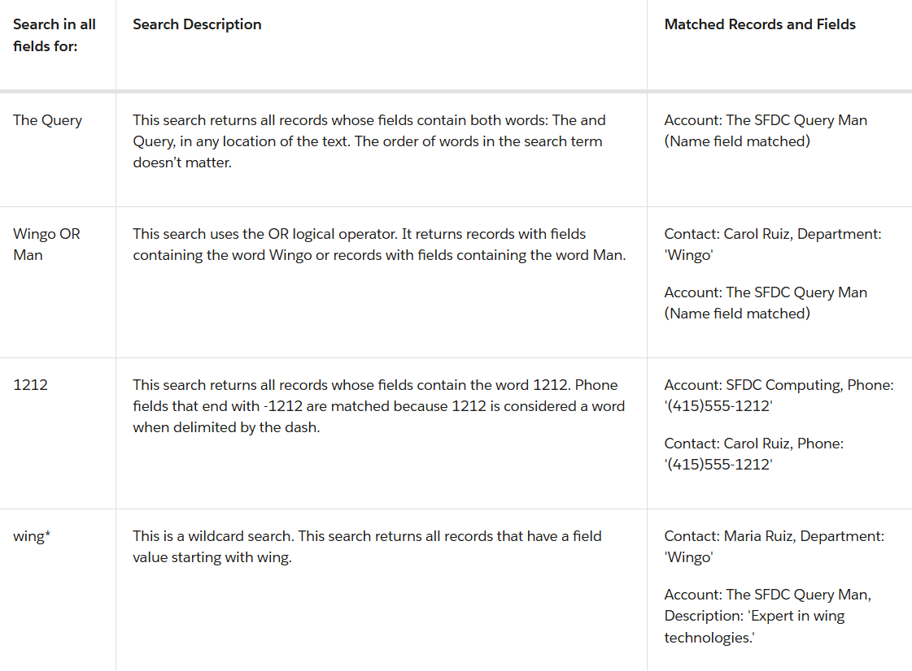

# Developer Notes

Developer related notes, tips, tricks that I decided to write down to save for later.

## Links

* [Heroku](https://trailhead.salesforce.com/content/learn/modules/heroku_enterprise_baiscs?trailmix_creator_id=auser1343&trailmix_slug=platform-developer-bootcamp-prework)

## Apex Collections

* List
* Array
* Set 
* Map

### Lists

List Syntax
```Apex
List<String> colors = new List<String>();
```

Array Notation
```Apex
String[] colors = new List<String>();
```

### Apex Classes

If you are calling a method that access class member variables you would need to call a method like this:

```Apex
EmailManager em = new EmailManager();
em.sendMail('Your email address', 'Trailhead Tutorial', '123 body');
```

If your method does not access class member variables you can call the method like this:

```Apex
EmailManager.sendMail('Your email address', 'Trailhead Tutorial', '123 body');
```

Static methods are easier to call than instance methods because they don’t need to be called on an instance of the class but are called directly on the class name. Just need to make sure static is in the method declaration.

### Creating Records with Apex

Every record in Salesforce is natively represented as an sObject in Apex.

To create an sObject, you need to declare a variable and assign an sObject instance to it. The data type of the variable is the sObject type.

The following example creates an sObject of type Account with the name Acme and assigns it to the acct variable.

```Apex
Account acct = new Account(Name='Acme');
```
Be sure to use the API name of whatever object you try to reference.

Before you can insert a Salesforce record, you must create it in memory first as an sObject. Like with any other object, sObjects are created with the new operator:

Typically you will have to add fields and values to the declaration of the sObject as well. There are two ways to add fields: through the constructor or by using dot notation.

Constructor:

```Apex
Account acct = new Account(Name='Acme', Phone='(415)555-1212', NumberOfEmployees=100);
``` 

Through Dot Notation:

```Apex
Account acct = new Account();
acct.Name = 'Acme';
acct.Phone = '(415)555-1212';
acct.NumberOfEmployees = 100;
```
The end result is the same, a new instance of an sObject declared in memory with fields and values. You will have to then use DML to update the database with this new record.

You can also assign Generic sObjects:

```Apex
sObject sobj1 = new Account(Name='Trailhead');
sObject sobj2 = new Book__c(Name='Workbook 1');
```
and...you can also cast a generic sObject to something like an account sObject type:

```Apex
// Cast a generic sObject to an Account
Account acct = (Account)myGenericSObject;
// Now, you can use the dot notation to access fields on Account
String name = acct.Name;
String phone = acct.Phone;
```

### DML

As mentioned before, once we create the sObject in memory we will have to use DML to actuall save it to the database.

```Apex
// Create the account sObject
Account acct = new Account(Name='Acme', Phone='(415)555-1212', NumberOfEmployees=100);
// Insert the account by using DML
insert acct;
```

DML Statements:

* insert
* update
* upsert
* delete
* undelete
* merge

You can pass a single or array of sObjects to DML statements. 

The upsert DML operation creates new records and updates sObject records within a single statement, using a specified field to determine the presence of existing objects, or the ID field if no field is specified.

The merge statement merges up to three records of the same sObject type into one of the records, deleting the others, and re-parenting any related records.

When inserting records, the system assigns an ID for each record. In addition to persisting the ID value in the database, the ID value is also auto-populated on the sObject variable that you used as an argument in the DML call.

How to get the ID of a record you just created:

```Apex
// Create the account sObject
Account acct = new Account(Name='Acme', Phone='(415)555-1212', NumberOfEmployees=100);
// Insert the account by using DML
insert acct;
// Get the new ID on the inserted sObject argument
ID acctID = acct.Id;
// Display this ID in the debug log
System.debug('ID = ' + acctID);
// Debug log result (the ID will be different in your case)
// DEBUG|ID = 001D000000JmKkeIAF
```

You can perform single DML operations or bulk DML operations but it is always insisted that you do bulk DML operations because it helps avoid hitting governor limits like DML limit of 150 per apex transaction.

Performing a DML operation on a list of sObjects counts as one DML statement, not as one statement for each sObject. Govorner limits are in place because Salesforce is multitenant which means all users share a pool of resources.

```Apex
// Create a list of contacts
List<Contact> conList = new List<Contact> {
    new Contact(FirstName='Joe',LastName='Smith',Department='Finance'),
        new Contact(FirstName='Kathy',LastName='Smith',Department='Technology'),
        new Contact(FirstName='Caroline',LastName='Roth',Department='Finance'),
        new Contact(FirstName='Kim',LastName='Shain',Department='Education')};
insert conList;
```
If you have a list containing a mix of new and existing records, you can process insertions and updates to all records in the list by using the upsert statement. Upsert helps avoid the creation of duplicate records and can save you time as you don’t have to determine which records exist first.

The upsert statement matches the sObjects with existing records by comparing values of one field. If you don’t specify a field when calling this statement, the upsert statement uses the sObject’s ID to match the sObject with existing records in Salesforce. Alternatively, you can specify a field to use for matching. For custom objects, specify a custom field marked as external ID. For standard objects, you can specify any field that has the idLookup property set to true. 

If the key is not matched, a new object record is created.
If the key is matched once, the existing object record is updated.
If the key is matched multiple times, an error is generated and the object record is neither inserted or updated.

```Apex
// Insert the Josh contact
Contact josh = new Contact(FirstName='Josh',LastName='Kaplan',Department='Finance');
insert josh;
// Josh's record has been inserted
//   so the variable josh has now an ID
//   which will be used to match the records by upsert
josh.Description = 'Josh\'s record has been updated by the upsert operation.';
// Create the Kathy contact, but don't persist it in the database
Contact kathy = new Contact(FirstName='Kathy',LastName='Brown',Department='Technology');
// List to hold the new contacts to upsert
List<Contact> contacts = new List<Contact> { josh, kathy };
// Call upsert
upsert contacts;
// Result: Josh is updated and Kathy is created.
```
Deleted records aren’t deleted permanently from Lightning Platform, but they’re placed in the Recycle Bin for 15 days from where they can be restored.

This is an example of how you delete records:

```Apex
Contact[] contactsDel = [SELECT Id FROM Contact WHERE LastName='Smith'];
delete contactsDel;
```

If a DML operation fails, it returns an exception of type DmlException. You can catch exceptions in your code to handle error conditions. This example produces a DmlException because it attempts to insert an account without the required Name field. The exception is caught in the catch block.

```Apex
try {
    // This causes an exception because
    //   the required Name field is not provided.
    Account acct = new Account();
    // Insert the account
    insert acct;
} catch (DmlException e) {
    System.debug('A DML exception has occurred: ' +
                e.getMessage());
}
```
Apex contains the built-in Database class, which provides methods that perform DML operations and mirror the DML statement counterparts.

These Database methods are static and are called on the class name.

Database.insert()
Database.update()
Database.upsert()
Database.delete()
Database.undelete()
Database.merge()

Unlike DML statements, Database methods have an optional allOrNone parameter that allows you to specify whether the operation should partially succeed. When this parameter is set to false, if errors occur on a partial set of records, the successful records will be committed and errors will be returned for the failed records. Also, no exceptions are thrown with the partial success option.

This is how you call the insert method with the allOrNone set to false.

```Apex
Database.insert(recordList, false);
```
The Database methods return result objects containing success or failure information for each record. For example, insert and update operations each return an array of Database.SaveResult objects.

```Apex
Database.SaveResult[] results = Database.insert(recordList, false);
```
By default, the allOrNone parameter is true, which means that the Database method behaves like its DML statement counterpart and will throw an exception if a failure is encountered.

The following two statements are equivalent to the insert recordList; statement.

```Apex
Database.insert(recordList);

Database.insert(recordList, true);
```
Let’s take a look at an example that uses the Database methods. This example is based on the bulk DML example, but replaces the DML statement with a Database method. The Database.insert() method is called with the partial success option. One contact in the list doesn’t have any fields on purpose and will cause an error because the contact can’t be saved without the required LastName field. Three contacts are committed and the contact without any fields generates an error. The last part of this example iterates through the returned results and writes debug messages to the debug log.

```Apex
// Create a list of contacts
List<Contact> conList = new List<Contact> {
        new Contact(FirstName='Joe',LastName='Smith',Department='Finance'),
        new Contact(FirstName='Kathy',LastName='Smith',Department='Technology'),
        new Contact(FirstName='Caroline',LastName='Roth',Department='Finance'),
        new Contact()};
// Bulk insert all contacts with one DML call
Database.SaveResult[] srList = Database.insert(conList, false);
// Iterate through each returned result
for (Database.SaveResult sr : srList) {
    if (sr.isSuccess()) {
        // Operation was successful, so get the ID of the record that was processed
        System.debug('Successfully inserted contact. Contact ID: ' + sr.getId());
    } else {
        // Operation failed, so get all errors
        for(Database.Error err : sr.getErrors()) {
            System.debug('The following error has occurred.');
            System.debug(err.getStatusCode() + ': ' + err.getMessage());
            System.debug('Contact fields that affected this error: ' + err.getFields());
	 }
    }
}
```
Should You Use DML Statements or Database Methods?

* Use DML statements if you want any error that occurs during bulk DML processing to be thrown as an Apex exception that immediately interrupts control flow (by using try. . .catch blocks). This behavior is similar to the way exceptions are handled in most database procedural languages.
* Use Database class methods if you want to allow partial success of a bulk DML operation—if a record fails, the remainder of the DML operation can still succeed. Your application can then inspect the rejected records and possibly retry the operation. When using this form, you can write code that never throws DML exception errors. Instead, your code can use the appropriate results array to judge success or failure. Note that Database methods also include a syntax that supports thrown exceptions, similar to DML statements.

You can insert records related to existing records if a relationship has already been defined between the two objects, such as a lookup or master-detail relationship.

This example shows how to add a contact to an account (the related record) by setting the AccountId field on the contact. Contact and Account are linked through a lookup relationship.

```Apex
Account acct = new Account(Name='SFDC Account');
insert acct;
// Once the account is inserted, the sObject will be
// populated with an ID.
// Get this ID.
ID acctID = acct.ID;
// Add a contact to this account.
Contact mario = new Contact(
    FirstName='Mario',
    LastName='Ruiz',
    Phone='415.555.1212',
    AccountId=acctID);
insert mario;
```
Fields on related records can't be updated with the same call to the DML operation and require a separate DML call.

```Apex
// Query for the contact, which has been associated with an account.
Contact queriedContact = [SELECT Account.Name
                          FROM Contact
                          WHERE FirstName = 'Mario' AND LastName='Ruiz'
                          LIMIT 1];
// Update the contact's phone number
queriedContact.Phone = '(415)555-1213';
// Update the related account industry
queriedContact.Account.Industry = 'Technology';
// Make two separate calls
// 1. This call is to update the contact's phone.
update queriedContact;
// 2. This call is to update the related account's Industry field.
update queriedContact.Account;
```
So you can add a related record to a record through one DML call but you cannot update that related record through the same DML call.

The delete operation supports cascading deletions. If you delete a parent object, you delete its children automatically, as long as each child record can be deleted.

```Apex
Account[] queriedAccounts = [SELECT Id FROM Account WHERE Name='SFDC Account'];
delete queriedAccounts;
```
This will delete the account but then also delete the Contact associated with that account.

DML operations execute within a transaction. 

### SOQL Queries

SOQL is similar to SQL and you can embed directly in Apex code becuase apex has direct access to salesforce records.

To include SOQL queries within your Apex code, wrap the SOQL statement within square brackets and assign the return value to an array of sObjects.

```Apex
Account[] accts = [SELECT Name,Phone FROM Account];
```
Its always a good idea to check your SOQL queries in the query editor before you put them in your Apex Code. Also, records arent always returned in the same order every time so it is a good idea to also order by on your queries.

You can sort on most fields, including numeric and text fields. You can’t sort on fields like rich text and multi-select picklists.

Another example:

```Apex
Account[] accts = [SELECT Name,Phone FROM Account
                   WHERE (Name='SFDC Computing' AND NumberOfEmployees>25)
                   ORDER BY Name
                   LIMIT 10];
System.debug(accts.size() + ' account(s) returned.');
// Write all account array info
System.debug(accts);
```
Access Variables in SOQL Queries

SOQL statements in Apex can reference Apex code variables and expressions if they are preceded by a colon (:). The use of a local variable within a SOQL statement is called a bind.This example shows how to use the targetDepartment variable in the WHERE clause.

```Apex
String targetDepartment = 'Wingo';
Contact[] techContacts = [SELECT FirstName,LastName
                          FROM Contact WHERE Department=:targetDepartment];
```
To get child records related to a parent record, add an inner query for the child records. The FROM clause of the inner query runs against the relationship name, rather than a Salesforce object name. This example contains an inner query to get all contacts that are associated with each returned account. The FROM clause specifies the Contacts relationship, which is a default relationship on Account that links accounts and contacts.

```Apex
SELECT Name, (SELECT LastName FROM Contacts) FROM Account WHERE Name = 'SFDC Computing'
```
In Apex:

```Apex
Account[] acctsWithContacts = [SELECT Name, (SELECT FirstName,LastName FROM Contacts)
                               FROM Account
                               WHERE Name = 'SFDC Computing'];
// Get child records
Contact[] cts = acctsWithContacts[0].Contacts;
System.debug('Name of first associated contact: '
             + cts[0].FirstName + ', ' + cts[0].LastName);
```
You can traverse a relationship from a child object (contact) to a field on its parent (Account.Name) by using dot notation. For example, the following Apex snippet queries contact records whose first name is Carol and is able to retrieve the name of Carol’s associated account by traversing the relationship between accounts and contacts.

```Apex
Contact[] cts = [SELECT Account.Name FROM Contact
                 WHERE FirstName = 'Carol' AND LastName='Ruiz'];
Contact carol = cts[0];
String acctName = carol.Account.Name;
System.debug('Carol\'s account name is ' + acctName);
```

Query Record in Batches By Using SOQL For Loops

With a SOQL for loop, you can include a SOQL query within a for loop. The results of a SOQL query can be iterated over within the loop. SOQL for loops use a different method for retrieving records—records are retrieved using efficient chunking with calls to the query and queryMore methods of the SOAP API. By using SOQL for loops, you can avoid hitting the heap size limit.

SOQL for loops iterate over all of the sObject records returned by a SOQL query. The syntax of a SOQL forloop is either:

```Apex
for (variable : [soql_query]) {
    code_block
}
```
```Apex
for (variable_list : [soql_query]) {
    code_block
}
```
Both  variable and  variable_list must be of the same type as the sObjects that are returned by the  soql_query.

It is preferable to use the sObject list format of the SOQL for loop as the loop executes once for each batch of 200 sObjects. Doing so enables you to work on batches of records and perform DML operations in batch, which helps avoid reaching governor limits.

```Apex
insert new Account[]{new Account(Name = 'for loop 1'),
                     new Account(Name = 'for loop 2'),
                     new Account(Name = 'for loop 3')};
// The sObject list format executes the for loop once per returned batch
// of records
Integer i=0;
Integer j=0;
for (Account[] tmp : [SELECT Id FROM Account WHERE Name LIKE 'for loop _']) {
    j = tmp.size();
    i++;
}
System.assertEquals(3, j); // The list should have contained the three accounts
                       // named 'yyy'
System.assertEquals(1, i); // Since a single batch can hold up to 200 records and,
                       // only three records should have been returned, the
                       // loop should have executed only once
```
One more example:

```Apex
public class ContactSearch {
    public static List<Contact> searchForContacts(String str1, String str2){
        List<Contact> con = new List<Contact>();
        con = [SELECT ID, Name FROM Contact WHERE LastName=:str1 AND MailingPostalCode=:str2];
        return con;
    }
}
```

The relationship name inside the nested query uses the plural name Contacts, as opposed to Contact. This detail is important to understand, and it’s the part that usually trips people up. When working with relationship queries, the parent-to-child relationship name must be a plural name.

```SQL
SELECT Name, (Select FirstName, LastName FROM Contacts) FROM Account
```
When working with custom objects, the relationship name is not only plural, but it is appended with two underscores and an r. For example, the relationship name for the custom object My_Object__c is My_Objects__r.


### SOSL Queries

Salesforce Object Search Language (SOSL) is a Salesforce search language that is used to perform text searches in records. Use SOSL to search fields across multiple standard and custom object records in Salesforce. SOSL is similar to Apache Lucene.

Adding SOSL queries to Apex is simple—you can embed SOSL queries directly in your Apex code. When SOSL is embedded in Apex, it is referred to as inline SOSL

```Apex
List<List<SObject>> searchList = [FIND 'SFDC' IN ALL FIELDS
                                      RETURNING Account(Name), Contact(FirstName,LastName)];
```
Like SOQL, SOSL allows you to search your organization’s records for specific information. Unlike SOQL, which can only query one standard or custom object at a time, a single SOSL query can search all objects.

Another difference is that SOSL matches fields based on a word match while SOQL performs an exact match by default (when not using wildcards). For example, searching for 'Digital' in SOSL returns records whose field values are 'Digital' or 'The Digital Company', but SOQL returns only records with field values of 'Digital'.

SOQL and SOSL are two separate languages with different syntax. Each language has a distinct use case:

* Use SOQL to retrieve records for a single object.
* Use SOSL to search fields across multiple objects. SOSL queries can search most text fields on an object.

Example:

```Apex
FIND {Wingo} IN ALL FIELDS RETURNING Account(Name), Contact(FirstName,LastName,Department)
```
The search query in the Query Editor and the API must be enclosed within curly brackets ({Wingo}). In contrast, in Apex the search query is enclosed within single quotes ('Wingo').

SOSL allows you to specify the following search criteria:

* Text expression (single word or a phrase) to search for
* Scope of fields to search
* List of objects and fields to retrieve
* Conditions for selecting rows in the source objects

This is the syntax of a basic SOSL query in Apex: 
```Apex
FIND 'SearchQuery' [IN SearchGroup] [RETURNING ObjectsAndFields]
```
Remember that in the Query Editor and API, the syntax is slightly different:
```Apex
FIND {SearchQuery} [IN SearchGroup] [RETURNING ObjectsAndFields]
```
SearchQuery is the text to search for (a single word or a phrase). Search terms can be grouped with logical operators (AND, OR) and parentheses. Also, search terms can include wildcard characters (*, ?). The * wildcard matches zero or more characters at the middle or end of the search term. The ? wildcard matches only one character at the middle or end of the search term.

Text searches are case-insensitive. For example, searching for Customer, customer, or CUSTOMER all return the same results.

SearchGroup is optional. It is the scope of the fields to search. If not specified, the default search scope is all fields. SearchGroup can take one of the following values.

* ALL FIELDS
* NAME FIELDS
* EMAIL FIELDS
* PHONE FIELDS
* SIDEBAR FIELDS

ObjectsAndFields is optional. It is the information to return in the search result—a list of one or more sObjects and, within each sObject, list of one or more fields, with optional values to filter against. If not specified, the search results contain the IDs of all objects found.

A SearchQuery contains two types of text:

* Single Word— single word, such as test or hello. Words in the SearchQuery are delimited by spaces, punctuation, and changes from letters to digits (and vice-versa). Words are always case insensitive.
* Phrase— collection of words and spaces surrounded by double quotes such as "john smith". Multiple words can be combined together with logic and grouping operators to form a more complex query.



SOSL Apex Example
This example shows how to run a SOSL query in Apex. First, the variable soslFindClause  is assigned the search query, which consists of two terms (Wingo and SFDC) combined by the OR logical operator. The SOSL query references this local variable by preceding it with a colon, also called binding. The resulting SOSL query searches for Wingo or SFDC in any field. This example returns all the sample accounts because they each have a field containing one of the words. The SOSL search results are returned in a list of lists. Each list contains an array of the returned records. In this case, the list has two elements. At index 0, the list contains the array of accounts. At index 1, the list contains the array of contacts.

```Apex
String soslFindClause = 'Wingo OR SFDC';
List<List<sObject>> searchList = [FIND :soslFindClause IN ALL FIELDS
                    RETURNING Account(Name),Contact(FirstName,LastName,Department)];
Account[] searchAccounts = (Account[])searchList[0];
Contact[] searchContacts = (Contact[])searchList[1];
System.debug('Found the following accounts.');
for (Account a : searchAccounts) {
    System.debug(a.Name);
}
System.debug('Found the following contacts.');
for (Contact c : searchContacts) {
    System.debug(c.LastName + ', ' + c.FirstName);
}
```
You can filter, reorder, and limit the returned results of a SOSL query. Because SOSL queries can return multiple sObjects, those filters are applied within each sObject inside the RETURNING clause.

You can filter SOSL results by adding conditions in the WHERE clause for an object. For example, this results in only accounts whose industry is Apparel to be returned: RETURNING Account(Name, Industry WHERE Industry='Apparel').

Likewise, ordering results for one sObject is supported by adding ORDER BY for an object. For example this causes the returned accounts to be ordered by the Name field: RETURNING Account(Name, Industry ORDER BY Name).

The number of returned records can be limited to a subset of records. This example limits the returned accounts to 10 only: RETURNING Account(Name, Industry LIMIT 10).

Challenge:

```Apex
public class ContactAndLeadSearch {
    public static List<List<sObject>> searchContactsAndLeads(String str){
       List<List<sObject>> searchList = [FIND :str IN ALL FIELDS RETURNING Contact(FirstName,LastName) ,Lead(FirstName,Lastname)];
        return searchList;
    }
}
```
### Triggers

Apex triggers enable you to perform custom actions before or after events to records in Salesforce, such as insertions, updates, or deletions.

The syntax of a trigger definition is different from a class definition’s syntax. A trigger definition starts with the trigger keyword. It is then followed by the name of the trigger, the Salesforce object that the trigger is associated with, and the conditions under which it fires. A trigger has the following syntax:

```Apex
trigger TriggerName on ObjectName (trigger_events) {
   code_block
}
```
To execute a trigger before or after insert, update, delete, and undelete operations, specify multiple trigger events in a comma-separated list. The events you can specify are:

* before insert
* before update
* before delete
* after insert
* after update
* after delete
* after undelete

Simple trigger example:

```Apex
trigger HelloWorldTrigger on Account (before insert) {
	System.debug('Hello World!');
}
```
Be sure to add a record to the trigger the...trigger

```Apex
Account a = new Account(Name='Test Trigger');
insert a;
```
There are two types of triggers.

* Before triggers are used to update or validate record values before they’re saved to the database.
* After triggers are used to access field values that are set by the system (such as a record's Id or LastModifiedDate field), and to affect changes in other records. The records that fire the after trigger are read-only.

To access the records that caused the trigger to fire, use context variables. For example, Trigger.new contains all the records that were inserted in insert or update triggers. Trigger.old provides the old version of sObjects before they were updated in update triggers, or a list of deleted sObjects in delete triggers. Triggers can fire when one record is inserted, or when many records are inserted in bulk via the API or Apex. Therefore, context variables, such as Trigger.new, can contain only one record or multiple records. You can iterate over Trigger.new to get each individual sObject.

Example:
```Apex
trigger HelloWorldTrigger on Account (before insert) {
    for(Account a : Trigger.new) {
        a.Description = 'New description';
    }
}
```
The system saves the records that fired the before trigger after the trigger finishes execution. You can modify the records in the trigger without explicitly calling a DML insert or update operation. If you perform DML statements on those records, you get an error.

Some other context variables return a Boolean value to indicate whether the trigger was fired due to an update or some other event. These variables are useful when a trigger combines multiple events. For example:

```Apex
trigger ContextExampleTrigger on Account (before insert, after insert, after delete) {
    if (Trigger.isInsert) {
        if (Trigger.isBefore) {
            // Process before insert
        } else if (Trigger.isAfter) {
            // Process after insert
        }
    }
    else if (Trigger.isDelete) {
        // Process after delete
    }
}
```
List of context variables can be found [here](https://trailhead.salesforce.com/content/learn/modules/apex_triggers/apex_triggers_intro?trailmix_creator_id=auser1343&trailmix_slug=platform-developer-bootcamp-prework)

You can use triggers to call methods from classes as well:
```Apex
trigger ExampleTrigger on Contact (after insert, after delete) {
    if (Trigger.isInsert) {
        Integer recordCount = Trigger.new.size();
        // Call a utility method from another class
        EmailManager.sendMail('Your email address', 'Trailhead Trigger Tutorial',
                    recordCount + ' contact(s) were inserted.');
    }
    else if (Trigger.isDelete) {
        // Process after delete
    }
}
```
You sometimes need to add restrictions on certain database operations, such as preventing records from being saved when certain conditions are met. To prevent saving records in a trigger, call the addError() method on the sObject in question. The addError() method throws a fatal error inside a trigger. The error message is displayed in the user interface and is logged.

Calling addError()in a trigger causes the entire set of operations to roll back, except when bulk DML is called with partial success.

If a bulk DML call in the Lightning Platform API spawned the trigger, the runtime engine sets the bad records aside. The runtime engine then attempts a partial save of the records that did not generate errors.
If a DML statement in Apex spawned the trigger, any error rolls back the entire operation. However, the runtime engine still processes every record in the operation to compile a comprehensive list of errors.

Apex allows you to make calls to and integrate your Apex code with external Web services. Apex calls to external Web services are referred to as callouts. For example, you can make a callout to a stock quote service to get the latest quotes. When making a callout from a trigger, the callout must be done asynchronously so that the trigger process doesn’t block you from working while waiting for the external service's response. The asynchronous callout is made in a background process, and the response is received when the external service returns it.

To make a callout from a trigger, call a class method that executes asynchronously. Such a method is called a future method and is annotated with @future(callout=true). This example class contains the future method that makes the callout.

```Apex
public class CalloutClass {
    @future(callout=true)
    public static void makeCallout() {
        HttpRequest request = new HttpRequest();
        // Set the endpoint URL.
        String endpoint = 'http://yourHost/yourService';
        request.setEndPoint(endpoint);
        // Set the HTTP verb to GET.
        request.setMethod('GET');
        // Send the HTTP request and get the response.
        HttpResponse response = new HTTP().send(request);
    }
}

trigger CalloutTrigger on Account (before insert, before update) {
    CalloutClass.makeCallout();
}
```

### Bulk Apex Triggers

Trigger that performs on a single sobject:
```Apex
trigger MyTriggerNotBulk on Account(before insert) {
    Account a = Trigger.new[0];
    a.Description = 'New description';
}
```
Trigger that performs bulk:
```Apex
trigger MyTriggerBulk on Account(before insert) {
    for(Account a : Trigger.new) {
        a.Description = 'New description';
    }
}
```
Avoid putting SOQL queries in loops in triggers to avoid hitting limits.

Example:
```Apex
trigger ClosedOpportunityTrigger on Opportunity (after insert, after update) {
    List<Task> taskList = new List<Task>();
    for(Opportunity opp : [SELECT Id FROM Opportunity WHERE ID IN:Trigger.New AND StageName='Closed Won']){
        taskList.add(new task(Subject='Follow Up Test Task',WhatId=opp.id));
    }
    
    insert taskList;
}
```
### Apex Compared to C#

The basic syntax for defining classes is:

```Apex
private | public | global
[virtual | abstract][with sharing | without sharing | inherited sharing]
class ClassName [implements InterfaceNameList] [extends ClassName]
{
    // The body of the class
}
```
Remember, an sObject is just a Salesforce object. You can think of it as a table in a database.

Additionally, a data type can be a typed list of values, also known as an enum. But watch out, because these aren’t the same enums you’re used to working with in .NET. In Apex, you can use enums with numbers, but you can’t define what these number values are. Also, the ordinal assignment starts at zero.

List
A list is an ordered collection of elements that works much the same as a traditional array. However, Apex does not support arrays as collections, just lists. You can, however, use what’s known as “array notation” to reference specific items in a list using square brackets, [].  For example, the following is one way to declare a variable as a list of strings:

```Apex
List<String> myStrings =  new List<String>();
```
Alternatively, you can declare the myStrings list variable using square brackets, as in the following:
```Apex
String[] myStrings = new List<String>();
```
Another thing you can do is declare the list and initialize its values, all in one step, such as the following.
```Apex
List<String> myStrings =  new List<String> {'String1', 'String2', 'String3' };
```

```Apex
public class AccountTriggerHandler {
    public static void CreateAccounts(List<Account> acctList){
        For (Account a : acctList){
            if(a.ShippingState!=a.BillingState)
             {
                 a.ShippingState = a.BillingState;
             }
        }
    }
}

trigger AccountTrigger on Account (before insert) {
    if(Trigger.isBefore && Trigger.isInsert){
        AccountTriggerHandler.CreateAccounts(Trigger.New);
    } 
}

@isTest
public class AccountTriggerTest {
	 @isTest static void TestCreateNewAccountInBulk() {
        List<Account> accts = new List<Account>();
        for(Integer i=0; i < 200; i++) {
            Account acct = new Account(Name='Test Account ' + i, BillingState = 'CA');
            accts.add(acct);
        }
        Test.startTest();
        insert accts;
        Test.stopTest();  
        System.assertEquals(200, [SELECT Count() FROM Account WHERE ShippingState = 'CA' ]);
    }
}
```

### Apex Testing

Apex tests must have at least 75% code coverage and also Apex can not be edited in a production Org.

Test Method Syntax:
```Apex
@isTest static void testName() {
  // code_block
}
```
The visibility of a test method doesn’t matter, so declaring a test method as public or private doesn’t make a difference as the testing framework is always able to access test methods. For this reason, the access modifiers are omitted in the syntax.

Test methods must be defined in test classes, which are classes annotated with @isTest. This sample class shows a definition of a test class with one test method.
```Apex
@isTest
private class MyTestClass {
  @isTest static void myTest() {
    // code_block
  }
}
```
Test classes can be either private or public. If you’re using a test class for unit testing only, declare it as private. Public test classes are typically used for test data factory classes, which are covered later.

The TemperatureConverterTest test class verifies that the method works as expected by calling it with different inputs for the temperature in Fahrenheit. Each test method verifies one type of input: a warm temperature, the freezing point temperature, the boiling point temperature, and a negative temperature. The verifications are done by calling the System.assertEquals() method, which takes two parameters: the first is the expected value, and the second is the actual value. There is another version of this method that takes a third parameter—a string that describes the comparison being done, which is used in testBoilingPoint(). This optional string is logged if the assertion fails.
```Apex
@isTest
private class TemperatureConverterTest {
  @isTest static void testWarmTemp() {
    Decimal celsius = TemperatureConverter.FahrenheitToCelsius(70);
    System.assertEquals(21.11,celsius);
  }
  @isTest static void testFreezingPoint() {
    Decimal celsius = TemperatureConverter.FahrenheitToCelsius(32);
    System.assertEquals(0,celsius);
  }
  @isTest static void testBoilingPoint() {
    Decimal celsius = TemperatureConverter.FahrenheitToCelsius(212);
    System.assertEquals(100,celsius,'Boiling point temperature is not expected.');
  }
  @isTest static void testNegativeTemp() {
    Decimal celsius = TemperatureConverter.FahrenheitToCelsius(-10);
    System.assertEquals(-23.33,celsius);
  }
}
```


